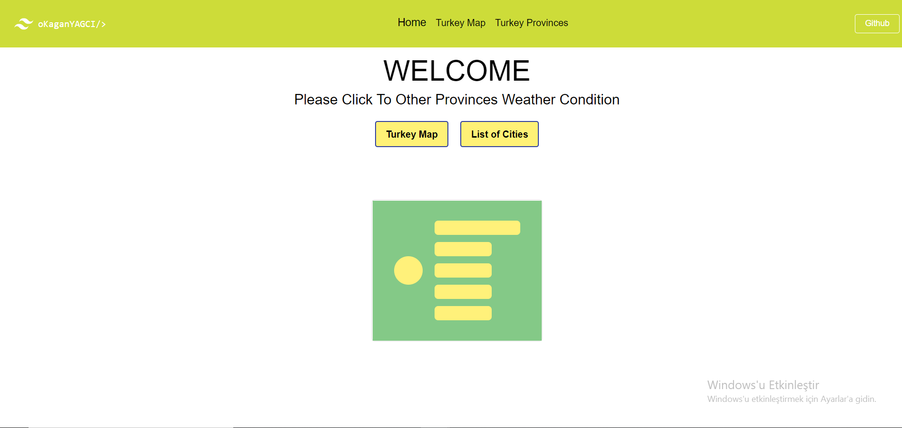

<!-- Please update value in the {}  -->

<h1 align="center"> Weather App Redux Toolkit TailwindCss</h1>

<div align="center">
  <h3>
    <a href="https://weather-app-webpackage-reduxtoolkit-omer-yagci.vercel.app/">
      Live Demo
    </a>
 
  </h3>
</div>

<!-- TABLE OF CONTENTS -->

## Table of Contents

- [Overview](#overview)
- [Built With](#built-with)
- [Features](#features)
- [How to use](#how-to-use)
- [Contact](#contact)

<!-- OVERVIEW -->

## Overview



## Built With

<!-- This section should list any major frameworks that you built your project using. Here are a few examples.-->

- React
- Redux Toolkit
- TailwindCss

## Features

This is my first project with Tailwindcss.I used Turkey Map and Turkey Cities NPM from [TurkeyMap](https://www.npmjs.com/package/turkey-map-react),[TurkeyCities](https://www.npmjs.com/package/use-turkey-cities).

## How To Use

<!-- This is an example, please update according to your application -->

To clone and run this application, you'll need [Git](https://git-scm.com)

```bash
# Clone this repository
$ git clone  https://github.com/omer-yagci/weather-app-webpackage-reduxtoolkit-.git

# Install dependencies
    $ yarn add

# Add .env file for API Keys and Firebase App Config

# Run the app
    $ yarn start
```

## Contact

- GitHub [omer-yagci](https://github.com/omer-yagci)
- Linkedin [Ömer Kağan Yağcı](https://www.linkedin.com/in/omer-kagan-yagci/)
